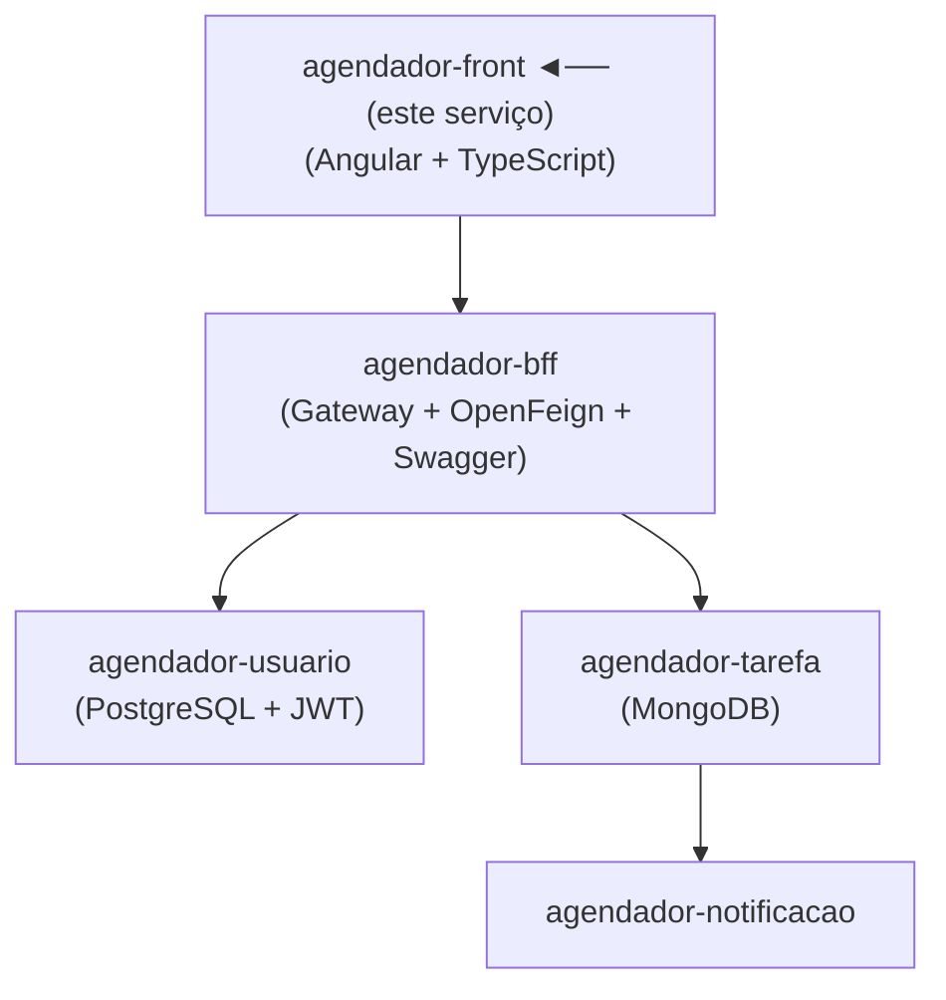

# 🖥️ Agendador — Frontend

> Interface web do sistema de agendamento de tarefas, desenvolvida em Angular com TypeScript.

---

## 📌 Sobre o Projeto

Aplicação frontend responsável pela interação do usuário com o ecossistema de agendamento. Consome a API do `agendador-bff`, gerencia autenticação com JWT e protege rotas para usuários não autenticados.

---

## 🏗️ Arquitetura do Ecossistema



---

## 🚀 Tecnologias

| Tecnologia | Finalidade |
|---|---|
| Angular | Framework principal |
| TypeScript | Tipagem estática |
| Angular Router + RouterState | Navegação e controle de estado de rota |
| HTTP Interceptor | Interceptação e injeção do token JWT nas requisições |
| Auth Service | Gerenciamento de autenticação (login, logout, token) |
| Auth Guard | Proteção de rotas autenticadas |
| Angular Services | Comunicação desacoplada com as APIs |

---

## ⚙️ Funcionalidades

- [x] Login e registro de usuários
- [x] Proteção de rotas via Auth Guard
- [x] Injeção automática do token JWT em todas as requisições autenticadas (HTTP Interceptor)
- [x] CRUD de tarefas/agendas
- [x] Gerenciamento de estado de rota com RouterState
- [x] Logout com limpeza de sessão

---

## 🔧 Como Executar

### Pré-requisitos
- Node.js 18+
- Angular CLI instalado globalmente

```bash
npm install -g @angular/cli
```

### Instalação

```bash
npm install
```

### Configuração

Atualize o arquivo `src/environments/environment.ts` com a URL do BFF:

```typescript
export const environment = {
  production: false,
  apiUrl: 'http://localhost:8080'
};
```

### Rodando a aplicação

```bash
ng serve
```

Acesse em: `http://localhost:4200`

---

## 🗂️ Estrutura de Pastas Relevante

```
src/
├── app/
│   ├── core/
│   │   ├── services/
│   │   │   └── auth.service.ts        # Gerenciamento de autenticação
│   │   ├── interceptors/
│   │   │   └── auth.interceptor.ts    # Injeção do JWT nas requisições
│   │   └── guards/
│   │       └── auth.guard.ts          # Proteção de rotas
│   ├── features/
│   │   ├── auth/                      # Login e registro
│   │   └── tarefas/                   # CRUD de tarefas
│   └── shared/                        # Componentes e modelos compartilhados
```

---

## 📂 Outros Serviços do Ecossistema

| Serviço | Descrição |
|---|---|
| [agendador-bff](../agendador-bff) | Gateway e documentação Swagger |
| [agendador-usuario](../agendador-usuario) | CRUD de usuários com autenticação JWT |
| [agendador-tarefa](../agendador-tarefa) | CRUD de tarefas com MongoDB |
| [agendador-notificacao](../agendador-notificacao) | Notificações por e-mail via Gmail API |

---
